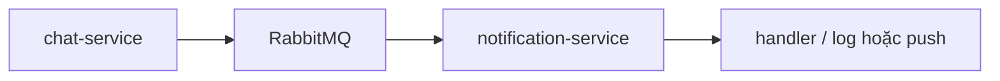

# chatapp-notification

Service **`notification-service`**: consume RabbitMQ (`message.created`), validate bằng `messageCreatedEventSchema` từ `@chatapp/common`. Hiện xử lý từng recipient bằng **log** structured (có thể mở rộng push và gọi chat qua `CHAT_SERVICE_URL` + `INTERNAL_API_TOKEN`, xem `src/chat/chatClient.ts`).

## Cấu trúc

```text
chatapp-notification/
├── services/notification-service/   # Express (/health) + consumer RabbitMQ
├── docker-compose.yml               # context build = thư mục cha (cả common + notification)
├── package.json                     # npm workspaces: services/*
└── .env.example
```

`@chatapp/common` trong `services/notification-service` khai báo `file:../../../chatapp-conversation/packages/common` — cần repo **`chatapp-conversation`** cùng cấp (hoặc chỉnh đường dẫn). Docker build kỳ vọng layout tương tự (xem `Dockerfile`).

Luồng khởi động: **`startConsumer()`** (RabbitMQ); sau đó HTTP **`GET /health`** trên `NOTIFICATION_SERVICE_PORT` (mặc định **4010**).

## Kiến trúc (Docker)



## HTTP

- **`GET /health`** — không có route API khác; không dùng `x-internal-token` (chỉ health cho orchestrator).

### Health

| Method | Path | Mô tả |
|--------|------|--------|
| GET | `/health` | Trạng thái service |

Payload sự kiện: type `message.created`, exchange **`conversation.events`**, queue **`notification-service.message-events`**. Chat-service publish cùng schema khi gửi tin (repo **`chatapp-conversation`**).

## RabbitMQ

| Chiều | Exchange | Routing key | Ghi chú |
|-------|-----------|-------------|---------|
| Consume | `conversation.events` | `message.created` | Queue `notification-service.message-events`, durable |

JSON không hợp lệ hoặc lỗi sau validate → **nack**, không requeue.

Không có `RABBITMQ_URL` → consumer không kết nối.

## Biến môi trường

Xem `.env.example`.

| Biến | Mô tả |
|------|--------|
| `RABBITMQ_URL` | Bắt buộc khi chạy consumer |
| `NOTIFICATION_SERVICE_PORT` | Mặc định `4010` |
| `NODE_ENV` | `development` / `production` |
| `CHAT_SERVICE_URL` | Tuỳ chọn — base URL chat-service (gọi `/internal` khi cần) |
| `INTERNAL_API_TOKEN` | Tuỳ chọn — trùng `INTERNAL_API_TOKEN` của chat-service |

## Chạy

```bash
cd chatapp-notification
( cd ../chatapp-conversation/packages/common && npm install && npm run build )
npm install
npm run build --workspace=services/notification-service
npm run dev --workspace=services/notification-service
```

Docker (từ thư mục chứa cả **`chatapp-notification`** và **`chatapp-conversation`**, ví dụ `micro/`):

```bash
docker network create chatapp-network
docker compose -f chatapp-notification/docker-compose.yml up --build
```

Service join mạng **`chatapp-network`** (`external: true`). Để có event thật: stack conversation cùng RabbitMQ và cùng network.

Kiểm tra: `curl http://localhost:${NOTIFICATION_SERVICE_PORT:-4010}/health`
